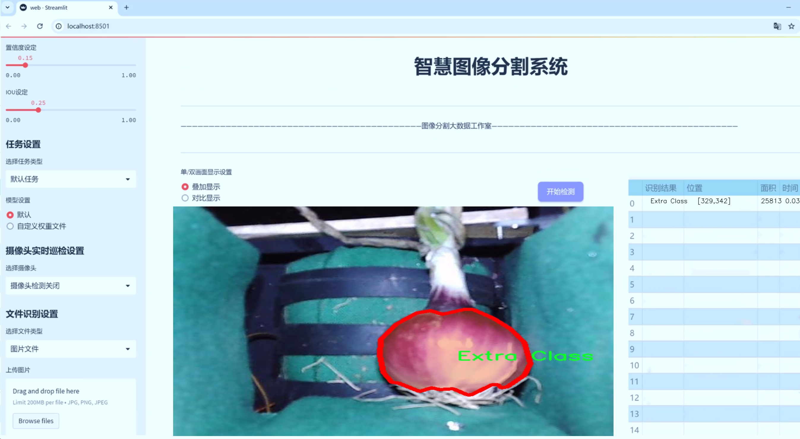
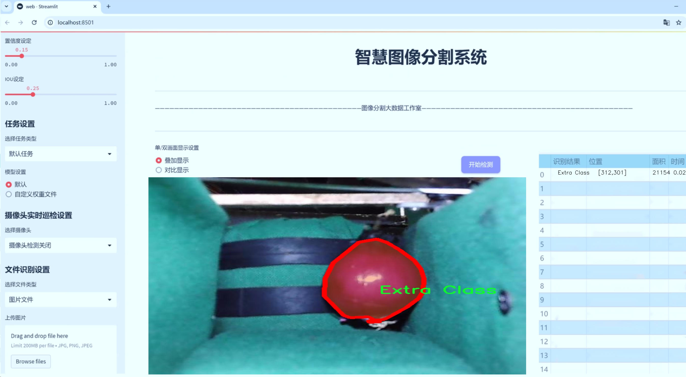
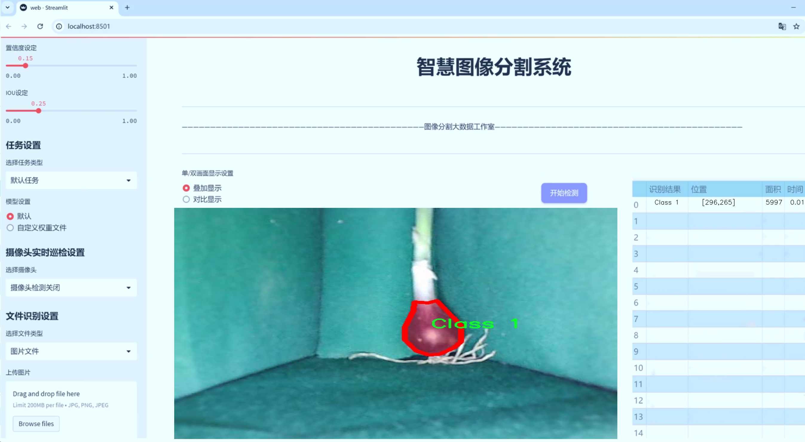
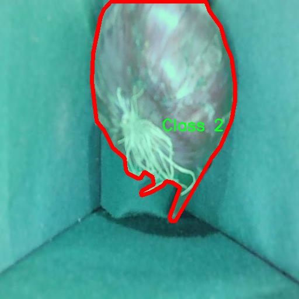
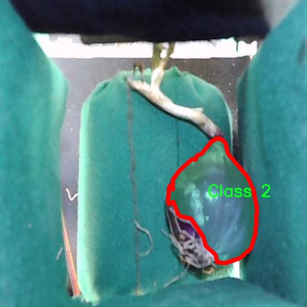
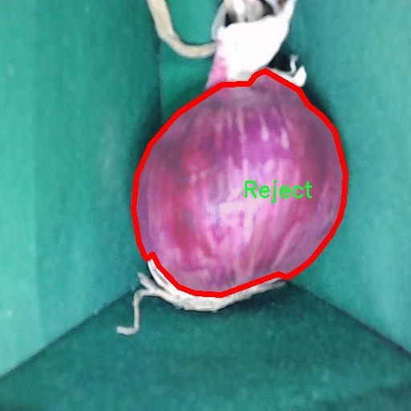
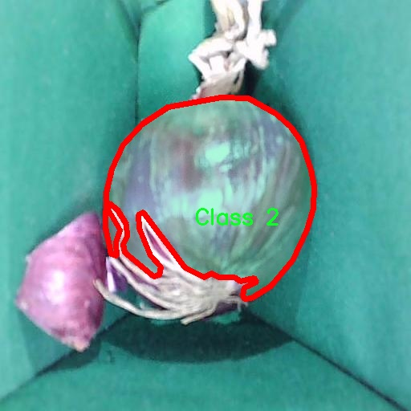
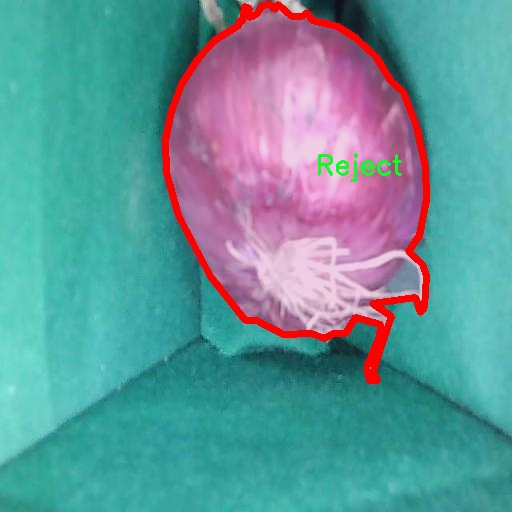

# 洋葱分级分割系统： yolov8-seg-C2f-DySnakeConv

### 1.研究背景与意义

[参考博客](https://gitee.com/YOLOv8_YOLOv11_Segmentation_Studio/projects)

[博客来源](https://kdocs.cn/l/cszuIiCKVNis)

研究背景与意义

洋葱作为全球重要的农作物之一，其在农业生产和市场流通中的地位不容忽视。随着人们对食品安全和质量的日益关注，洋葱的分级与分割工作变得尤为重要。传统的洋葱分级方法往往依赖人工操作，不仅效率低下，而且容易受到人为因素的影响，导致分级结果的不一致性和准确性不足。因此，基于计算机视觉技术的自动化洋葱分级系统应运而生，成为提升生产效率和产品质量的重要手段。

近年来，深度学习技术的迅猛发展为图像处理领域带来了新的机遇，尤其是目标检测和实例分割技术的应用，使得自动化分级系统的构建成为可能。YOLO（You Only Look Once）系列模型因其高效的实时处理能力和良好的检测精度，逐渐成为目标检测领域的主流选择。YOLOv8作为该系列的最新版本，进一步优化了模型的结构和算法，提升了在复杂场景下的表现能力。通过对YOLOv8的改进，结合洋葱分级的特定需求，构建一个高效的洋葱分级分割系统，将为农业生产带来深远的影响。

本研究所使用的数据集包含3000张洋葱图像，涵盖了四个类别：Class 1、Class 2、Extra Class和Reject。这些类别的设定不仅考虑了洋葱的外观特征，还反映了市场对洋葱质量的不同需求。通过对这些图像进行实例分割，可以有效地将不同类别的洋葱进行区分，为后续的自动化分级提供数据支持。这一过程不仅提高了分级的准确性，还能大幅度提升分级的效率，降低人工成本。

在实际应用中，洋葱的分级不仅影响了市场销售价格，也直接关系到消费者的购买体验和食品安全。因此，构建一个基于改进YOLOv8的洋葱分级分割系统，不仅具有重要的学术价值，也具有显著的社会经济意义。通过实现自动化分级，可以减少人工操作带来的误差，提高洋葱的市场竞争力，推动农业现代化进程。

此外，随着智能农业和精准农业的不断发展，基于深度学习的图像处理技术在农作物分级中的应用前景广阔。本研究不仅为洋葱分级提供了一种新的解决方案，也为其他农作物的智能分级提供了借鉴和参考。通过对YOLOv8模型的改进与优化，未来可以将该技术推广至更多的农作物分级任务中，助力农业生产的智能化转型。

综上所述，基于改进YOLOv8的洋葱分级分割系统的研究，不仅是对深度学习技术在农业领域应用的探索，也是对提高农产品质量和安全性的重要实践，具有重要的理论意义和实际应用价值。

### 2.图片演示







注意：本项目提供完整的训练源码数据集和训练教程,由于此博客编辑较早,暂不提供权重文件（best.pt）,需要按照6.训练教程进行训练后实现上图效果。

### 3.视频演示

[3.1 视频演示](https://www.bilibili.com/video/BV1GM6AYiEWB/)

### 4.数据集信息

##### 4.1 数据集类别数＆类别名

nc: 4
names: ['Class 1', 'Class 2', 'Extra Class', 'Reject']


##### 4.2 数据集信息简介

数据集信息展示

在本研究中，我们使用了名为“Onion Grading”的数据集，旨在改进YOLOv8-seg模型在洋葱分级分割任务中的表现。该数据集专门设计用于训练和评估洋葱的分级系统，具有丰富的图像样本和多样的标注信息，能够有效支持模型的学习与优化。

“Onion Grading”数据集包含四个主要类别，分别为“Class 1”、“Class 2”、“Extra Class”和“Reject”。这些类别代表了洋葱在分级过程中的不同质量标准。具体而言，“Class 1”通常指的是高质量的洋葱，外观完好，符合市场销售的标准；“Class 2”则可能包含一些轻微瑕疵的洋葱，虽然仍可销售，但不如“Class 1”理想；“Extra Class”类别则用于标识那些在外观或其他特征上具有特殊情况的洋葱，可能是由于其独特的形状或颜色而被单独分类；而“Reject”类别则是指那些因严重缺陷而不适合销售的洋葱。这种细致的分类不仅有助于提高分级的准确性，还能为后续的质量控制和市场销售提供有力的数据支持。

数据集中的图像样本数量丰富，涵盖了不同品种、不同生长阶段和不同环境条件下的洋葱。这种多样性确保了模型在训练过程中能够接触到各种可能的场景，从而提升其泛化能力。此外，数据集中的每张图像都经过精确的标注，确保了每个类别的样本都能够清晰地被识别和学习。这种高质量的标注对于深度学习模型的训练至关重要，因为它直接影响到模型的学习效果和最终的分割精度。

在数据预处理阶段，我们对“Onion Grading”数据集进行了多种处理，以适应YOLOv8-seg模型的输入要求。这包括图像的缩放、归一化以及数据增强等步骤。数据增强技术如随机裁剪、旋转和颜色调整等，能够有效扩展训练样本的多样性，帮助模型更好地应对实际应用中的各种变化。

此外，为了确保模型的训练和评估过程的科学性，我们将数据集划分为训练集、验证集和测试集。训练集用于模型的学习，验证集用于调整模型参数，而测试集则用于最终的性能评估。这种划分策略能够有效避免过拟合现象，并确保模型在未见数据上的表现能够真实反映其泛化能力。

综上所述，“Onion Grading”数据集为改进YOLOv8-seg的洋葱分级分割系统提供了坚实的基础。通过充分利用该数据集的丰富信息和多样化样本，我们期望能够实现更高效、更准确的洋葱分级分割，从而推动农业自动化和智能化的发展。数据集的设计和构建不仅考虑了实际应用需求，还为后续的研究提供了宝贵的参考，具有重要的学术价值和实际意义。











### 5.项目依赖环境部署教程（零基础手把手教学）

[5.1 环境部署教程链接（零基础手把手教学）](https://www.bilibili.com/video/BV1jG4Ve4E9t/?vd_source=bc9aec86d164b67a7004b996143742dc)


[5.2 安装Python虚拟环境创建和依赖库安装视频教程链接（零基础手把手教学）](https://www.bilibili.com/video/BV1nA4VeYEze/?vd_source=bc9aec86d164b67a7004b996143742dc)

### 6.手把手YOLOV8-seg训练视频教程（零基础手把手教学）

[6.1 手把手YOLOV8-seg训练视频教程（零基础小白有手就能学会）](https://www.bilibili.com/video/BV1cA4VeYETe/?vd_source=bc9aec86d164b67a7004b996143742dc)


按照上面的训练视频教程链接加载项目提供的数据集，运行train.py即可开始训练



     Epoch   gpu_mem       box       obj       cls    labels  img_size
     1/200     0G   0.01576   0.01955  0.007536        22      1280: 100%|██████████| 849/849 [14:42<00:00,  1.04s/it]
               Class     Images     Labels          P          R     mAP@.5 mAP@.5:.95: 100%|██████████| 213/213 [01:14<00:00,  2.87it/s]
                 all       3395      17314      0.994      0.957      0.0957      0.0843

     Epoch   gpu_mem       box       obj       cls    labels  img_size
     2/200     0G   0.01578   0.01923  0.007006        22      1280: 100%|██████████| 849/849 [14:44<00:00,  1.04s/it]
               Class     Images     Labels          P          R     mAP@.5 mAP@.5:.95: 100%|██████████| 213/213 [01:12<00:00,  2.95it/s]
                 all       3395      17314      0.996      0.956      0.0957      0.0845

     Epoch   gpu_mem       box       obj       cls    labels  img_size
     3/200     0G   0.01561    0.0191  0.006895        27      1280: 100%|██████████| 849/849 [10:56<00:00,  1.29it/s]
               Class     Images     Labels          P          R     mAP@.5 mAP@.5:.95: 100%|███████   | 187/213 [00:52<00:00,  4.04it/s]
                 all       3395      17314      0.996      0.957      0.0957      0.0845


### 7.50+种全套YOLOV8-seg创新点加载调参实验视频教程（一键加载写好的改进模型的配置文件）

[7.1 50+种全套YOLOV8-seg创新点加载调参实验视频教程（一键加载写好的改进模型的配置文件）](https://www.bilibili.com/video/BV1Hw4VePEXv/?vd_source=bc9aec86d164b67a7004b996143742dc)

### YOLOV8-seg算法简介

原始YOLOV8-seg算法原理

YOLOv8-seg算法是YOLO系列中的一个重要进展，旨在提升目标检测和分割任务的性能。该算法在设计上继承了YOLO系列的高效性和实时性，同时引入了一些创新的机制，以应对复杂环境下的挑战。与传统的anchor-based检测方法相比，YOLOv8-seg采用了anchor-free的方法，这一转变不仅提高了检测精度，还显著提升了检测速度。其核心思想是通过直接回归目标的位置和类别，而不是依赖于预定义的锚框，从而简化了模型的训练过程和推理过程。

YOLOv8-seg的网络结构主要由输入端、主干网络、Neck端和输出端四个模块组成。输入端负责对输入图像进行预处理，包括Mosaic数据增强、自适应图像缩放和灰度填充等。这些预处理步骤旨在提高模型对不同场景和光照条件的适应能力，确保输入数据的多样性和丰富性。接下来，主干网络通过卷积、池化等操作提取图像特征。主干网络中的C2f模块通过跨层连接增强了模型的梯度流，促进了特征的有效提取，而SPPF模块则通过多尺度特征的处理提升了网络的特征抽象能力。

在Neck端，YOLOv8-seg采用了PAN（Path Aggregation Network）结构，通过上采样和下采样操作融合不同尺度的特征图。这一设计使得模型能够有效地捕捉到目标在不同尺度下的特征信息，从而提高了对小目标的检测能力。Neck端的特征融合过程对于复杂场景中的目标检测至关重要，因为目标的大小和形状可能会受到背景的影响，尤其是在水面等复杂环境中。

输出端则采用了解耦的检测头结构，通过两个并行的卷积分支分别计算回归和分类的损失。这种解耦设计使得模型在处理分类和回归任务时能够更加灵活，避免了传统方法中分类和回归相互干扰的问题。YOLOv8-seg在损失计算方面引入了BCE（Binary Cross-Entropy）和DFL（Distribution Focal Loss）等先进的损失函数，以提升模型的学习效果和泛化能力。

尽管YOLOv8-seg在许多方面都表现出色，但在复杂水面环境下仍然面临一些挑战。小目标漂浮物的特征复杂且背景多样，导致了定位误差和对目标感知能力不足的问题。为了解决这些问题，YOLOv8-seg引入了YOLOv8-WSSOD算法的改进方案。首先，通过引入BiFormer双层路由注意力机制，构建了C2fBF模块，以减轻主干网络下采样过程中的噪声影响。该模块能够有效捕获远程依赖关系，保留特征提取过程中更细粒度的上下文信息，从而提升了模型对小目标的感知能力。

其次，为了进一步提高对小目标的检测能力，YOLOv8-WSSOD在网络中添加了一个更小的检测头。这一设计使得模型能够更好地关注小目标的特征，降低漏检的风险。同时，在Neck端引入GSConv和Slim-neck技术，旨在保持检测精度的同时降低计算量，从而实现更高效的推理过程。这些改进使得YOLOv8-seg在处理复杂场景时，能够更加准确地定位和识别目标。

最后，YOLOv8-WSSOD还使用了MPDIoU损失函数替换了传统的CIoU损失函数。这一替换不仅提高了模型的泛化能力，还增强了定位精度，使得YOLOv8-seg在各种复杂环境下的表现更加稳健。MPDIoU损失函数通过考虑目标的形状和位置关系，能够更全面地评估检测结果的质量，从而为模型的训练提供更有效的反馈。

综上所述，YOLOv8-seg算法通过引入一系列创新的设计和改进，提升了目标检测和分割的性能。其在处理复杂水面环境中的小目标时，展现出了更高的准确性和鲁棒性。随着目标检测技术的不断发展，YOLOv8-seg无疑将在实际应用中发挥重要作用，尤其是在需要高效、实时检测的场景中。通过不断优化和改进，YOLOv8-seg将为目标检测领域带来新的机遇和挑战。


### 9.系统功能展示（检测对象为举例，实际内容以本项目数据集为准）

图9.1.系统支持检测结果表格显示

  图9.2.系统支持置信度和IOU阈值手动调节

  图9.3.系统支持自定义加载权重文件best.pt(需要你通过步骤5中训练获得)

  图9.4.系统支持摄像头实时识别

  图9.5.系统支持图片识别

  图9.6.系统支持视频识别

  图9.7.系统支持识别结果文件自动保存

  图9.8.系统支持Excel导出检测结果数据


### 10.50+种全套YOLOV8-seg创新点原理讲解（非科班也可以轻松写刊发刊，V11版本正在科研待更新）

#### 10.1 由于篇幅限制，每个创新点的具体原理讲解就不一一展开，具体见下列网址中的创新点对应子项目的技术原理博客网址【Blog】：


[10.1 50+种全套YOLOV8-seg创新点原理讲解链接](https://gitee.com/qunmasj/good)

#### 10.2 部分改进模块原理讲解(完整的改进原理见上图和技术博客链接)【如果此小节的图加载失败可以通过CSDN或者Github搜索该博客的标题访问原始博客，原始博客图片显示正常】
### YOLOv8简介
在各种目标检测算法中，YOLO系列因其速度和准确度间的优异平衡脱颖而出，能够准确、快速的识别目标，便于部署到各种移动设备中，已经广泛应用于各种领域的目标检测、跟踪和分割。目前最新版本 YOLOv8由原v5的开发团队Ultralytics于2023年1月提出，按规格大小可划分为n、s、m、1和x5个版本，是目前最先进的目标检测算法，有着优异的性能，很适合用于无人机航拍图像目标检测。其网络结构如图所示。

YOLOv8模型包括Input、Backbone、Neck 和Head4部分。其中 Input选用了Mosaic数据增强方法，并且对于不同大小的模型，有部分超参数会进行修改，典型的如大模型会开启 MixUp 和CopyPaste数据增强，能够丰富数据集，提升模型的泛化能力和鲁棒性。Backbone主要用于提取图片中的信息，提供给Neck和Head使用，由多个Conv、C2f模块和尾部的SPPF组成。Conv模块由单个Conv2d、
BatchNorm2d和激活函数构成,用丁是双行在万E5特征图;YOLOv8参考了C3模块的残左绒以心YOLOv7[16l的ELAN思想，设计出了C2f 结构，可以在保证轻量化的同时获得更加丰富的梯度流信息，并根据模型尺度来调整通道数，大幅提升了模型性能;SPPF是空间金字塔池化，能够融合不同尺度的特征。Neck部分主要起特征融合的作用，充分利用了骨干网络提取的特征，采用FPN[17]+PAN[18〕结构，
能够增强多个尺度上的语义表达和定位能力。Head输出端根据前两部分处理得到的特征来获取检测目标的类别和位置信息，做出识别,换以小旦公来和定解耦头结构,将分类和检测头分:9w‘无锅框的位关注侧重点不同的问题，同时也采用了无锚框的目标检测（Anchor-Free)，能够提升检测速度。Loss计算方面采用了正负样本动态分配策略，使用 VFLLoss 作为分类损失，使用DFLLoss+CIOU Loss作为回归损失。

### AutoFocus: Efficient Multi-Scale Conv简介

参考该博客提出了AutoFocus，一种高效的多尺度目标检测算法。相较于以前对整个图像金字塔进行处理，该方法以一种由表及里的姿态，仅处理哪些整体上看来很有可能存在小物体的区域。这个可以通过预测一张类别未知的分割图FocusPixels来得到。为了高效利用FocusPixels，另外一个算法用于产生包含FocusPixels的FocusChips，这样可以减少计算量并处理更更精细的尺度。在不同尺度上FocusChips所得到的检测结果综合时，会出现问题，我们也提供了解决问题的方案。AutoFocus在COCO上的结果有49.7%mAP（50%重叠下68.3%），与多尺度baseline相仿但是快了2.5倍。金字塔中处理的像素数量减少了5倍mAP只下降1%，在与RetinaNet采用相同的ResNet-101结构且速度相同时，高了10%mAP。

人类寻找物体是一个动态的过程，且寻找时间与场景的复杂度是直接相关的。当我们的眼神在不同的点之间漂移时，其他的区域会被我们有意忽视。然而，现在的检测算法是一种静态的推理过程且图像金字塔中的每个像素都受到了一样的对待，这使得过程变得没有效率。现在许多的应用都不强调实时性，而计算上的节省其实可以产生很大收益。

在COCO数据集中，虽然40%的物体都是小物体，但是它们一共只占了全图的0.3%。如果金字塔是3倍关系，则在高分辨率层要进行9倍的运算。XXX 。那么有没有办法在低分辨率下找出可能含有这些物体的区域呢？

以人眼方案类比，我们可以从低分辨率图像开始，找出有可能存在物体的区域再“聚集”到高分辨率。我们的AutoFocus会在一层中计算小物体的分割图FocusPixels，而在每一个FocusPixels上会用一个算法产生下一层所需要关注的chips。在COCO的最大分辨率层上我们可以只处理**20%的像素而性能不下降，如果只处理5%**也只下降1%而已。


图像金字塔与卷积神经网络对CV十分重要。然而卷积神经网络无法做到对尺度不敏感，所以为了不同大小的物体需要依赖图像金字塔。虽然训练已经有了高效的方法，但是其推断时间依然远离实际使用标准。

目标检测加速有很长历史了。常用的有特征近似以减少尺度、级联、特征金字塔，且最后一个最近很多人研究。

AutoFocus为速度与精度之间提供了一个平滑的折衷，指出可以在低分辨率下看出小物体的所在，从而节约计算。FocusPixels的计算较为容易。

先简单介绍一下SNIP，是一种多尺度的训练、推断算法。主要思想是训练针对某个特定scale的检测器而不是scale-invariant检测器。这样训练样本就局限于在某个尺度范围内，以适于这个检测器处理。比如在高分辨率仅处理小物体而高分辨率仅处理大物体，其优势在于训练时不用考虑尺度的变化。

由于训练时物体大小是已知的，我们在图像金字塔中可以忽略大量区域而只处理物体周围的区域。SNIPER说明这样低分辨率的训练与全图训练相比并不会降低性能。同样，在推断过程中如果可以在大分辨率图像上预测可能出现小物体的chip，我们也就不用处理整张高分辨率图片。在训练时，许多物体会被裁剪、扭曲，这可以当作是一种数据扩增，然而当这个情况在推断时出现，则会产生错误，所以我们还需要一个算法来整合不同尺度上的检测结果。

#### AutoFocus框架
如SIFT、SURF等传统分类特征包含两个组件，一个detector和一个descriptor。detector只包含轻量级的操作如DoG、LoG，用于在整张图片上找到感兴趣的区域；descriptor，一般来说计算量比较大，则只需要关注那些咸兴趣的区域。这个级联结构保障了图片处理的效率。

同样，AutoFocus框架也是用于预测感兴趣的区域，并丢弃在下一尺度不可能存在物体的区域，并将裁剪和缩放后的区域传递给下一尺度。AutoFocus由三个部分组成：FocusPixels，FocusChips和focus stacking。

#### FocusPixels
FocusPixels定义在卷积网络特征图的粒度之上（如conv5），如果特征图上某个像素与小物体有重叠则标注为一个FocusPixel。（小物体：面积处于一个网络的输入范围之内）。训练过程中，FocusPixels标注为正，某些与不在面积范围内的物体有重叠的像素标注为无效，其他像素标注为负。AutoFocus的训练目标是使在FocusPixels区域产生较大的激活值。

如果同时多个物体与同一像素重叠，优先给正标注。我们的网络输入是512x512，然后a,b,c取值分别是5,64,90。对于太大或太小的物体，我们认为当前尺度上没有足够人信息进行判断，所以会标定为无效。整个网络结构如下图。训练时加两层带ReLU的卷积(3x3和1x1)以及一个二分类softmax来预测FocusPixels。


#### FocusChip生成
推断过程中，我们标注输出概率大于阈值t的像素（这个参数可以控制加速比），得到一些连通域。对于每一个域，我们做一次膨胀使其包含一些有助于识别的周围信息，膨胀后相连的部分要合并。然后，我们生成一些包含连通域的chips（不同chips可能重叠，如有重叠则合并）。有些chip可能太小缺少必要信息，并使chip的大小变化很大，为了效率我们要求保证一个最小的chip size。算法流程如下：


#### 级联推断过程
我们的过程类似于图片金字塔的推断过程但是在过程中一步步去除不关注的图片区域。我们在最低分辨率上进行检测并生成chips，然后在这些chips再进行检测和生成chips。

#### Focus Stacking
这种级联分类器的一个问题是在chip边缘本来的大物体可能生成一些被剪裁的检测目标。在下一个尺度上，由于剪裁过了，所以会检测到小的、错误的正例False Positive。之前算法中的第二步膨胀其实就是为了保证没有物体会出现在chip的边缘。这样，当我们在局部图片chip的边缘检测到物体时，就可以把这个检测结果丢弃，即使其在SNIP的范围内。

也有一些物体在图片边缘的特殊情况。如果chip和图片共享一条边的话，我们会检查检测结果的其他边是否完全在里面，如果在，则保留它，否则丢弃。

在每一尺度得到有效检测结果后，我们可以将不同尺度上的结果进行整合，将这些结果映射到原图坐标系上。最后，非极大值抑制NMS用于聚集。网络结构如之前的图片所示。


### 11.项目核心源码讲解（再也不用担心看不懂代码逻辑）

#### 11.1 ultralytics\cfg\__init__.py

以下是对给定代码的核心部分进行提炼和详细注释的结果：

```python
# 导入必要的库和模块
import sys
from pathlib import Path
from typing import Dict, Union
from ultralytics.utils import yaml_load, LOGGER, DEFAULT_CFG_DICT, checks, colorstr

# 定义有效的任务和模式
MODES = 'train', 'val', 'predict', 'export', 'track', 'benchmark'
TASKS = 'detect', 'segment', 'classify', 'pose'

# 任务与数据集、模型、评估指标的映射
TASK2DATA = {
    'detect': 'coco8.yaml',
    'segment': 'coco8-seg.yaml',
    'classify': 'imagenet10',
    'pose': 'coco8-pose.yaml'
}
TASK2MODEL = {
    'detect': 'yolov8n.pt',
    'segment': 'yolov8n-seg.pt',
    'classify': 'yolov8n-cls.pt',
    'pose': 'yolov8n-pose.pt'
}

def cfg2dict(cfg):
    """
    将配置对象转换为字典格式，可以是文件路径、字符串或SimpleNamespace对象。

    参数:
        cfg (str | Path | dict | SimpleNamespace): 要转换的配置对象。

    返回:
        cfg (dict): 转换后的字典格式配置对象。
    """
    if isinstance(cfg, (str, Path)):
        cfg = yaml_load(cfg)  # 从文件加载字典
    elif isinstance(cfg, SimpleNamespace):
        cfg = vars(cfg)  # 转换为字典
    return cfg

def get_cfg(cfg: Union[str, Path, Dict] = DEFAULT_CFG_DICT, overrides: Dict = None):
    """
    从文件或字典加载并合并配置数据。

    参数:
        cfg (str | Path | Dict | SimpleNamespace): 配置数据。
        overrides (Dict | optional): 覆盖配置的字典。默认为None。

    返回:
        (SimpleNamespace): 训练参数的命名空间。
    """
    cfg = cfg2dict(cfg)  # 转换配置为字典

    # 合并覆盖的配置
    if overrides:
        overrides = cfg2dict(overrides)
        cfg = {**cfg, **overrides}  # 合并cfg和覆盖字典

    # 返回配置的命名空间
    return SimpleNamespace(**cfg)

def entrypoint(debug=''):
    """
    该函数是Ultralytics包的入口点，负责解析传递给包的命令行参数。

    参数:
        debug (str): 调试信息。
    """
    args = (debug.split(' ') if debug else sys.argv)[1:]  # 获取命令行参数
    if not args:  # 如果没有参数
        LOGGER.info("No arguments provided.")
        return

    overrides = {}  # 存储覆盖的参数
    for a in args:
        if '=' in a:
            k, v = a.split('=', 1)  # 分割参数
            overrides[k] = v  # 存储覆盖参数
        elif a in TASKS:
            overrides['task'] = a  # 存储任务
        elif a in MODES:
            overrides['mode'] = a  # 存储模式

    # 检查并获取配置
    cfg = get_cfg(overrides=overrides)

    # 运行指定的模式
    mode = overrides.get('mode', 'predict')  # 默认模式为预测
    task = overrides.get('task')  # 获取任务
    model = TASK2MODEL.get(task, 'yolov8n.pt')  # 获取模型

    # 运行模型的指定模式
    model_instance = YOLO(model, task=task)  # 创建模型实例
    getattr(model_instance, mode)(**overrides)  # 调用模型的指定模式方法

if __name__ == '__main__':
    entrypoint()  # 调用入口函数
```

### 代码分析与注释说明：
1. **导入模块**：导入了系统模块、路径处理模块和类型注解模块，以及Ultralytics库中的工具函数和常量。
2. **定义常量**：定义了有效的任务和模式，并创建了任务与数据集、模型、评估指标的映射字典。
3. **cfg2dict函数**：用于将配置对象转换为字典格式，支持多种输入类型。
4. **get_cfg函数**：加载并合并配置数据，返回一个命名空间对象，方便后续使用。
5. **entrypoint函数**：程序的主入口，解析命令行参数，获取任务和模式，并根据这些参数运行相应的模型方法。
6. **__main__模块**：确保在直接运行脚本时调用入口函数。

这些核心部分是实现Ultralytics YOLO命令行接口的基础，负责解析用户输入、加载配置并执行相应的模型操作。

这个文件是Ultralytics YOLO（You Only Look Once）项目的初始化文件，主要用于配置和管理YOLO模型的各种参数和命令行接口。文件中包含了多个功能模块和函数，以下是对文件内容的逐步分析和说明。

首先，文件导入了一些必要的库和模块，包括`contextlib`、`shutil`、`sys`、`Path`等，此外还导入了`ultralytics.utils`中的多个工具函数和常量。这些工具函数和常量为后续的配置和功能实现提供了支持。

接下来，文件定义了一些有效的任务和模式。任务包括检测（detect）、分割（segment）、分类（classify）和姿态估计（pose），而模式则包括训练（train）、验证（val）、预测（predict）、导出（export）、跟踪（track）和基准测试（benchmark）。这些定义为后续的命令行解析和功能调用提供了基础。

文件中还定义了一些常量，例如`TASK2DATA`、`TASK2MODEL`和`TASK2METRIC`，它们分别将任务映射到相应的数据集、模型文件和评估指标。这些映射关系在模型训练和评估时非常重要。

CLI_HELP_MSG是一个多行字符串，提供了关于如何使用YOLO命令的帮助信息，包括命令的语法、可用的任务和模式示例。用户可以通过命令行调用这些功能，并根据需要传递参数。

接下来的部分定义了一些用于配置检查的键，包括浮点数、整数和布尔值类型的键。这些键用于验证用户输入的配置参数是否符合预期的类型和范围。

`cfg2dict`函数用于将配置对象转换为字典格式，无论输入是文件路径、字符串还是`SimpleNamespace`对象。这个函数在加载和合并配置时非常有用。

`get_cfg`函数用于加载和合并配置数据，可以从文件、字典或`SimpleNamespace`对象中获取配置，并支持覆盖默认配置。它还会进行类型和数值检查，确保配置的有效性。

`get_save_dir`函数根据训练、验证或预测的参数返回保存目录，确保生成的目录路径是唯一的。

`_handle_deprecation`函数用于处理已弃用的配置键，发出警告并更新为新的配置键。

`check_dict_alignment`函数检查自定义配置与基础配置之间的键是否匹配，如果发现不匹配的键，会提供相似的有效键的建议并退出程序。

`merge_equals_args`函数用于合并参数列表中的孤立等号参数，确保参数格式正确。

`handle_yolo_hub`和`handle_yolo_settings`函数分别处理与Ultralytics HUB和YOLO设置相关的命令行接口命令。

`parse_key_value_pair`函数用于解析`key=value`格式的参数，并返回键和值。

`smart_value`函数用于将字符串转换为相应的类型，如整数、浮点数或布尔值。

`entrypoint`函数是Ultralytics包的入口点，负责解析传递给包的命令行参数。它支持指定任务、模式以及传递覆盖配置，并根据解析的参数调用相应的功能。

最后，文件中定义了一个特殊模式的函数`copy_default_cfg`，用于复制默认配置文件并创建一个新的配置文件。

整体来看，这个文件是Ultralytics YOLO项目的核心部分之一，负责配置管理、命令行解析和功能调用，为用户提供了灵活的使用方式和强大的功能支持。

#### 11.2 ultralytics\models\utils\loss.py

以下是经过简化和注释的核心代码部分，主要集中在损失计算的实现上：

```python
import torch
import torch.nn as nn
import torch.nn.functional as F
from ultralytics.utils.loss import FocalLoss, VarifocalLoss
from ultralytics.utils.metrics import bbox_iou
from .ops import HungarianMatcher

class DETRLoss(nn.Module):
    """
    DETR (DEtection TRansformer) 损失类。该类计算并返回DETR目标检测模型的不同损失组件。
    包括分类损失、边界框损失、GIoU损失和可选的辅助损失。
    """

    def __init__(self, nc=80, loss_gain=None, aux_loss=True, use_fl=True, use_vfl=False):
        """
        初始化DETR损失函数。

        参数:
            nc (int): 类别数量。
            loss_gain (dict): 各损失组件的系数。
            aux_loss (bool): 是否计算辅助损失。
            use_fl (bool): 是否使用FocalLoss。
            use_vfl (bool): 是否使用VarifocalLoss。
        """
        super().__init__()
        if loss_gain is None:
            loss_gain = {'class': 1, 'bbox': 5, 'giou': 2}
        self.nc = nc  # 类别数量
        self.loss_gain = loss_gain  # 损失系数
        self.aux_loss = aux_loss  # 是否使用辅助损失
        self.fl = FocalLoss() if use_fl else None  # Focal Loss对象
        self.vfl = VarifocalLoss() if use_vfl else None  # Varifocal Loss对象
        self.matcher = HungarianMatcher(cost_gain={'class': 2, 'bbox': 5, 'giou': 2})  # 匹配器

    def _get_loss_class(self, pred_scores, targets, gt_scores, num_gts):
        """计算分类损失。"""
        bs, nq = pred_scores.shape[:2]  # 获取批次大小和查询数量
        one_hot = torch.zeros((bs, nq, self.nc + 1), dtype=torch.int64, device=targets.device)  # 创建one-hot编码
        one_hot.scatter_(2, targets.unsqueeze(-1), 1)  # 将目标值转换为one-hot编码
        one_hot = one_hot[..., :-1]  # 去掉最后一列

        gt_scores = gt_scores.view(bs, nq, 1) * one_hot  # 计算ground truth分数

        if self.fl:
            loss_cls = self.vfl(pred_scores, gt_scores, one_hot) if num_gts else self.fl(pred_scores, one_hot.float())
            loss_cls /= max(num_gts, 1) / nq  # 归一化损失
        else:
            loss_cls = nn.BCEWithLogitsLoss(reduction='none')(pred_scores, gt_scores).mean(1).sum()  # 计算BCE损失

        return {'loss_class': loss_cls.squeeze() * self.loss_gain['class']}  # 返回分类损失

    def _get_loss_bbox(self, pred_bboxes, gt_bboxes):
        """计算边界框损失和GIoU损失。"""
        loss = {}
        if len(gt_bboxes) == 0:
            return {'loss_bbox': torch.tensor(0.), 'loss_giou': torch.tensor(0.)}  # 如果没有ground truth，返回0损失

        loss['loss_bbox'] = self.loss_gain['bbox'] * F.l1_loss(pred_bboxes, gt_bboxes, reduction='sum') / len(gt_bboxes)  # L1损失
        loss['loss_giou'] = 1.0 - bbox_iou(pred_bboxes, gt_bboxes, xywh=True, GIoU=True)  # 计算GIoU损失
        loss['loss_giou'] = loss['loss_giou'].sum() / len(gt_bboxes) * self.loss_gain['giou']  # 归一化GIoU损失
        return loss  # 返回损失字典

    def _get_loss(self, pred_bboxes, pred_scores, gt_bboxes, gt_cls):
        """计算所有损失。"""
        match_indices = self.matcher(pred_bboxes, pred_scores, gt_bboxes, gt_cls)  # 计算匹配索引
        idx, gt_idx = self._get_index(match_indices)  # 获取索引
        pred_bboxes, gt_bboxes = pred_bboxes[idx], gt_bboxes[gt_idx]  # 根据索引获取预测和真实边界框

        targets = torch.full((pred_scores.shape[0], pred_scores.shape[1]), self.nc, device=pred_scores.device, dtype=gt_cls.dtype)  # 创建目标张量
        targets[idx] = gt_cls[gt_idx]  # 更新目标张量

        gt_scores = torch.zeros_like(targets, device=pred_scores.device)  # 创建ground truth分数张量
        if len(gt_bboxes):
            gt_scores[idx] = bbox_iou(pred_bboxes.detach(), gt_bboxes, xywh=True).squeeze(-1)  # 计算IOU

        loss = {}
        loss.update(self._get_loss_class(pred_scores, targets, gt_scores, len(gt_bboxes)))  # 更新分类损失
        loss.update(self._get_loss_bbox(pred_bboxes, gt_bboxes))  # 更新边界框损失
        return loss  # 返回所有损失

    def forward(self, pred_bboxes, pred_scores, batch):
        """
        前向传播，计算损失。

        参数:
            pred_bboxes (torch.Tensor): 预测的边界框。
            pred_scores (torch.Tensor): 预测的分数。
            batch (dict): 包含ground truth信息的字典。

        返回:
            (dict): 包含总损失的字典。
        """
        gt_cls, gt_bboxes = batch['cls'], batch['bboxes']  # 获取ground truth
        total_loss = self._get_loss(pred_bboxes[-1], pred_scores[-1], gt_bboxes, gt_cls)  # 计算总损失
        return total_loss  # 返回总损失
```

### 代码说明：
1. **DETRLoss类**：该类用于计算DETR模型的损失，包括分类损失和边界框损失。
2. **初始化方法**：设置类别数量、损失系数、是否使用辅助损失等。
3. **_get_loss_class方法**：计算分类损失，使用Focal Loss或BCE损失。
4. **_get_loss_bbox方法**：计算边界框损失和GIoU损失。
5. **_get_loss方法**：整合分类损失和边界框损失的计算。
6. **forward方法**：前向传播，接收预测的边界框和分数，计算并返回总损失。

这段代码的核心在于损失的计算和整合，为目标检测模型的训练提供了基础。

这个程序文件是Ultralytics YOLO模型中的一个损失计算模块，主要用于计算DETR（DEtection TRansformer）模型的损失。文件中定义了两个类：`DETRLoss`和`RTDETRDetectionLoss`，分别用于计算DETR模型和RT-DETR模型的损失。

`DETRLoss`类的构造函数接收多个参数，包括类别数量、损失增益系数、是否计算辅助损失、是否使用Focal Loss和Varifocal Loss等。它初始化了一些属性，如类别数量、匹配器（HungarianMatcher）和损失对象（FocalLoss和VarifocalLoss）。在类中，定义了多个方法来计算不同类型的损失，包括分类损失、边界框损失和GIoU损失。

`_get_loss_class`方法计算分类损失。它首先将目标类别转换为one-hot编码，然后根据是否使用Focal Loss或Varifocal Loss来计算损失。`_get_loss_bbox`方法计算边界框损失和GIoU损失，使用L1损失计算边界框的差异，并通过IOU计算GIoU损失。

`_get_loss_aux`方法用于计算辅助损失，支持多层解码器的输出。它会遍历每一层的预测结果，调用`_get_loss`方法计算损失，并将结果累加。

`_get_loss`方法是损失计算的核心，首先通过匹配器计算匹配索引，然后根据这些索引提取预测的边界框和真实的边界框，接着计算分类损失和边界框损失。

`forward`方法是类的入口，接收预测的边界框和分数，以及包含真实标签的批次数据，最终返回总损失。

`RTDETRDetectionLoss`类继承自`DETRLoss`，用于计算RT-DETR模型的损失。它在`forward`方法中添加了对去噪声训练损失的支持，如果提供了去噪声的元数据，则会计算相应的损失。

总体而言，这个文件实现了DETR和RT-DETR模型的损失计算逻辑，支持多种损失类型和辅助损失的计算，适用于目标检测任务。

#### 11.3 ultralytics\engine\model.py

以下是经过简化并添加详细中文注释的核心代码部分：

```python
import torch
from pathlib import Path
from typing import Union
from ultralytics.nn.tasks import nn  # 导入基础神经网络模块

class Model(nn.Module):
    """
    YOLO模型的基础类，统一所有模型的API。
    """

    def __init__(self, model: Union[str, Path] = 'yolov8n.pt', task=None) -> None:
        """
        初始化YOLO模型。

        Args:
            model (Union[str, Path], optional): 要加载或创建的模型路径或名称，默认为'yolov8n.pt'。
            task (Any, optional): YOLO模型的任务类型，默认为None。
        """
        super().__init__()
        self.model = None  # 模型对象
        self.task = task  # 任务类型
        model = str(model).strip()  # 去除模型名称两端的空格

        # 检查是否为Ultralytics HUB模型
        if self.is_hub_model(model):
            from ultralytics.hub.session import HUBTrainingSession
            self.session = HUBTrainingSession(model)  # 创建HUB训练会话
            model = self.session.model_file  # 获取模型文件

        # 加载或创建新的YOLO模型
        suffix = Path(model).suffix
        if suffix in ('.yaml', '.yml'):
            self._new(model, task)  # 从配置文件创建新模型
        else:
            self._load(model, task)  # 从权重文件加载模型

    def _new(self, cfg: str, task=None):
        """
        从模型配置文件初始化新模型并推断任务类型。

        Args:
            cfg (str): 模型配置文件
            task (str | None): 模型任务
        """
        cfg_dict = yaml_model_load(cfg)  # 加载YAML配置文件
        self.task = task or guess_model_task(cfg_dict)  # 推断任务类型
        self.model = self._smart_load('model')(cfg_dict)  # 创建模型

    def _load(self, weights: str, task=None):
        """
        从权重文件加载模型并推断任务类型。

        Args:
            weights (str): 要加载的模型权重
            task (str | None): 模型任务
        """
        self.model, self.ckpt = attempt_load_one_weight(weights)  # 加载权重
        self.task = self.model.args['task']  # 获取任务类型

    def predict(self, source=None, stream=False, **kwargs):
        """
        使用YOLO模型进行预测。

        Args:
            source (str | int | PIL | np.ndarray): 进行预测的图像源。
            stream (bool): 是否流式预测，默认为False。

        Returns:
            (List[ultralytics.engine.results.Results]): 预测结果。
        """
        if source is None:
            source = ASSETS  # 默认源
        return self.predictor(source=source, stream=stream)  # 调用预测器进行预测

    def is_hub_model(self, model):
        """检查提供的模型是否为HUB模型。"""
        return model.startswith('https://hub.ultralytics.com/models/')  # 检查URL前缀

    def _smart_load(self, key):
        """加载模型、训练器、验证器或预测器。"""
        try:
            return self.task_map[self.task][key]  # 根据任务类型获取相应的类
        except Exception as e:
            raise NotImplementedError(f"模型不支持该任务类型：{self.task}") from e

    @property
    def task_map(self):
        """返回任务到模型、训练器、验证器和预测器类的映射。"""
        raise NotImplementedError('请为您的模型提供任务映射！')
```

### 代码说明：
1. **类的定义**：`Model`类继承自`nn.Module`，用于定义YOLO模型的基础结构。
2. **初始化方法**：`__init__`方法负责初始化模型，支持从文件加载模型或创建新模型。
3. **模型加载**：`_new`和`_load`方法分别用于从配置文件和权重文件加载模型。
4. **预测方法**：`predict`方法用于执行模型的预测操作，支持多种输入源。
5. **HUB模型检查**：`is_hub_model`方法用于判断模型是否来自Ultralytics HUB。
6. **智能加载**：`_smart_load`方法根据任务类型加载相应的类。
7. **任务映射**：`task_map`属性定义了任务与模型、训练器、验证器和预测器之间的映射关系。

这个程序文件定义了一个名为 `Model` 的类，主要用于实现 YOLO（You Only Look Once）目标检测模型的统一接口。该类继承自 PyTorch 的 `nn.Module`，并提供了一系列方法和属性，以便于加载、训练、预测和评估模型。

在初始化方法 `__init__` 中，用户可以传入模型文件的路径或名称（默认为 'yolov8n.pt'）以及任务类型。类的属性包括预测器、模型对象、训练器、任务类型、检查点、配置等。初始化过程中会检查模型是否来自 Ultralytics HUB 或 Triton Server，并根据文件后缀加载相应的模型或配置。

`__call__` 方法允许用户通过调用实例来执行预测，实际上是调用了 `predict` 方法。`is_triton_model` 和 `is_hub_model` 方法用于判断给定的模型是否为 Triton Server 或 Ultralytics HUB 的模型。

`_new` 和 `_load` 方法分别用于初始化新模型和加载已有模型。`_check_is_pytorch_model` 方法用于确保加载的模型是 PyTorch 格式。`reset_weights` 方法用于重置模型的参数，`load` 方法用于加载权重。

`info` 方法用于记录模型的信息，`fuse` 方法用于融合模型的卷积层和批归一化层，以加快推理速度。`predict` 方法执行目标检测，支持多种输入源类型，并返回预测结果。

`track` 方法用于在输入源上执行目标跟踪，`val` 方法用于在给定数据集上验证模型。`benchmark` 方法用于对模型在所有导出格式上的性能进行基准测试，`export` 方法用于导出模型。

`train` 方法用于在给定数据集上训练模型，支持自定义训练器。`tune` 方法用于进行超参数调优，支持使用 Ray Tune。`_apply` 方法用于将设备（如 CPU 或 GPU）应用于模型的张量。

类中还定义了一些属性，如 `names`、`device` 和 `transforms`，用于获取模型的类名、设备信息和变换操作。用户可以通过 `add_callback`、`clear_callback` 和 `reset_callbacks` 方法管理回调函数。

最后，`_smart_load` 方法用于加载模型、训练器、验证器和预测器，`task_map` 属性用于映射任务到相应的类。`profile` 方法用于对模型进行性能分析。

整体而言，这个类提供了一个全面的接口，使得用户能够方便地使用 YOLO 模型进行目标检测任务。

#### 11.4 demo_test_camera.py

以下是经过简化和注释的核心代码部分：

```python
import cv2
import numpy as np
from PIL import ImageFont, ImageDraw, Image
from hashlib import md5
from model import Web_Detector
from chinese_name_list import Label_list

def generate_color_based_on_name(name):
    # 使用MD5哈希函数生成一个稳定的颜色值
    hash_object = md5(name.encode())
    hex_color = hash_object.hexdigest()[:6]  # 取前6位16进制数作为颜色
    r, g, b = int(hex_color[0:2], 16), int(hex_color[2:4], 16), int(hex_color[4:6], 16)
    return (b, g, r)  # OpenCV使用BGR格式

def draw_with_chinese(image, text, position, font_size=20, color=(255, 0, 0)):
    # 在图像上绘制中文文本
    image_pil = Image.fromarray(cv2.cvtColor(image, cv2.COLOR_BGR2RGB))  # 转换为PIL格式
    draw = ImageDraw.Draw(image_pil)  # 创建绘图对象
    font = ImageFont.truetype("simsun.ttc", font_size, encoding="unic")  # 加载中文字体
    draw.text(position, text, font=font, fill=color)  # 绘制文本
    return cv2.cvtColor(np.array(image_pil), cv2.COLOR_RGB2BGR)  # 转换回OpenCV格式

def draw_detections(image, info):
    # 在图像上绘制检测结果
    name, bbox = info['class_name'], info['bbox']  # 获取类别名称和边界框
    x1, y1, x2, y2 = bbox  # 解包边界框坐标
    cv2.rectangle(image, (x1, y1), (x2, y2), color=(0, 0, 255), thickness=3)  # 绘制边界框
    image = draw_with_chinese(image, name, (x1, y1 - 10), font_size=20)  # 绘制类别名称
    return image

def process_frame(model, image):
    # 处理每一帧图像
    pre_img = model.preprocess(image)  # 预处理图像
    pred = model.predict(pre_img)  # 进行预测
    det = pred[0]  # 获取检测结果

    if det is not None and len(det):
        det_info = model.postprocess(pred)  # 后处理得到检测信息
        for info in det_info:
            image = draw_detections(image, info)  # 绘制检测结果
    return image

if __name__ == "__main__":
    model = Web_Detector()  # 初始化检测模型
    model.load_model("./weights/yolov8s-seg.pt")  # 加载模型权重

    # 摄像头实时处理
    cap = cv2.VideoCapture(0)  # 打开摄像头
    while cap.isOpened():
        ret, frame = cap.read()  # 读取一帧
        if not ret:
            break
        processed_frame = process_frame(model, frame)  # 处理帧
        cv2.imshow('Camera Feed', processed_frame)  # 显示处理后的帧
        if cv2.waitKey(1) & 0xFF == ord('q'):  # 按'q'退出
            break
    cap.release()  # 释放摄像头
    cv2.destroyAllWindows()  # 关闭所有OpenCV窗口
```

### 代码注释说明：
1. **生成颜色**：`generate_color_based_on_name` 函数通过MD5哈希生成一个稳定的颜色，确保同一名称总是得到相同的颜色。
2. **绘制中文文本**：`draw_with_chinese` 函数将中文文本绘制到图像上，使用PIL库处理中文字体。
3. **绘制检测结果**：`draw_detections` 函数负责在图像上绘制检测到的对象的边界框和类别名称。
4. **处理每一帧**：`process_frame` 函数负责预处理图像、进行模型预测并绘制检测结果。
5. **主程序**：在主程序中，初始化模型并打开摄像头进行实时处理，按下'q'键可退出。

这个程序文件`demo_test_camera.py`的主要功能是通过摄像头实时捕捉视频流，并对每一帧进行目标检测和分割，最后将检测结果以可视化的方式展示出来。以下是对代码的详细说明。

首先，程序导入了一些必要的库，包括`random`、`cv2`（OpenCV库）、`numpy`、`PIL`（用于处理图像）、`hashlib`（用于生成哈希值）、以及自定义的`Web_Detector`模型和`Label_list`中文名称列表。

程序定义了几个辅助函数。`generate_color_based_on_name(name)`函数使用MD5哈希算法根据给定的名称生成一个稳定的颜色，这样可以确保同一个名称总是对应同一种颜色。`calculate_polygon_area(points)`函数计算给定点构成的多边形的面积，使用OpenCV的`contourArea`方法。`draw_with_chinese(image, text, position, font_size=20, color=(255, 0, 0))`函数则负责在图像上绘制中文文本，使用PIL库来处理中文字体。

`adjust_parameter(image_size, base_size=1000)`函数根据图像的大小调整参数，以便在绘制时保持比例。`draw_detections(image, info, alpha=0.2)`函数是核心部分，它根据检测到的信息在图像上绘制边界框、掩膜和相关的度量信息（如面积、周长、圆度和颜色值）。如果没有掩膜，则绘制矩形框；如果有掩膜，则填充多边形并计算其相关特征。

`process_frame(model, image)`函数处理每一帧图像，首先对图像进行预处理，然后使用模型进行预测，最后将检测到的目标信息传递给`draw_detections`函数进行可视化。

在`__main__`部分，程序加载了目标检测模型，并通过OpenCV打开摄像头进行实时视频捕捉。在一个循环中，程序不断读取摄像头的帧，调用`process_frame`函数处理每一帧，并通过`cv2.imshow`显示处理后的图像。如果用户按下'q'键，程序将退出循环，释放摄像头资源并关闭所有窗口。

总体而言，这个程序实现了一个实时目标检测系统，能够在视频流中识别并标注目标，同时展示目标的相关信息。

#### 11.5 ultralytics\data\augment.py

以下是代码中最核心的部分，并附上详细的中文注释：

```python
class BaseTransform:
    """
    图像变换的基础类。

    这个通用的变换类可以根据特定的图像处理需求进行扩展。
    该类设计为兼容分类和语义分割任务。

    方法：
        __init__: 初始化 BaseTransform 对象。
        apply_image: 对标签应用图像变换。
        apply_instances: 对标签中的对象实例应用变换。
        apply_semantic: 对图像应用语义分割变换。
        __call__: 对图像、实例和语义掩码应用所有标签变换。
    """

    def __init__(self) -> None:
        """初始化 BaseTransform 对象。"""
        pass

    def apply_image(self, labels):
        """对标签应用图像变换。"""
        pass

    def apply_instances(self, labels):
        """对标签中的对象实例应用变换。"""
        pass

    def apply_semantic(self, labels):
        """对图像应用语义分割变换。"""
        pass

    def __call__(self, labels):
        """对图像、实例和语义掩码应用所有标签变换。"""
        self.apply_image(labels)
        self.apply_instances(labels)
        self.apply_semantic(labels)


class Mosaic(BaseMixTransform):
    """
    马赛克增强类。

    该类通过将多个（4个或9个）图像组合成一个马赛克图像来执行马赛克增强。
    增强以给定的概率应用于数据集。

    属性：
        dataset: 应用马赛克增强的数据集。
        imgsz (int, optional): 单个图像的马赛克管道后的图像大小（高度和宽度）。默认为640。
        p (float, optional): 应用马赛克增强的概率。必须在0-1范围内。默认为1.0。
        n (int, optional): 网格大小，4（2x2）或9（3x3）。
    """

    def __init__(self, dataset, imgsz=640, p=1.0, n=4):
        """初始化对象，设置数据集、图像大小、概率和边界。"""
        assert 0 <= p <= 1.0, f'概率应在[0, 1]范围内，但得到的是 {p}。'
        assert n in (4, 9), '网格必须等于4或9。'
        super().__init__(dataset=dataset, p=p)
        self.dataset = dataset
        self.imgsz = imgsz
        self.border = (-imgsz // 2, -imgsz // 2)  # 边界宽度和高度
        self.n = n

    def get_indexes(self, buffer=True):
        """返回数据集中随机索引的列表。"""
        if buffer:  # 从缓冲区选择图像
            return random.choices(list(self.dataset.buffer), k=self.n - 1)
        else:  # 选择任何图像
            return [random.randint(0, len(self.dataset) - 1) for _ in range(self.n - 1)]

    def _mix_transform(self, labels):
        """对输入图像和标签应用混合增强。"""
        assert labels.get('rect_shape', None) is None, '矩形和马赛克是互斥的。'
        assert len(labels.get('mix_labels', [])), '没有其他图像用于马赛克增强。'
        return self._mosaic4(labels) if self.n == 4 else self._mosaic9(labels)

    def _mosaic4(self, labels):
        """创建一个2x2的图像马赛克。"""
        mosaic_labels = []
        s = self.imgsz
        yc, xc = (int(random.uniform(-x, 2 * s + x)) for x in self.border)  # 马赛克中心 x, y
        for i in range(4):
            labels_patch = labels if i == 0 else labels['mix_labels'][i - 1]
            img = labels_patch['img']
            h, w = labels_patch.pop('resized_shape')

            # 将图像放置在 img4 中
            if i == 0:  # 左上角
                img4 = np.full((s * 2, s * 2, img.shape[2]), 114, dtype=np.uint8)  # 用4个图块构建的基础图像
                x1a, y1a, x2a, y2a = max(xc - w, 0), max(yc - h, 0), xc, yc  # 大图的 xmin, ymin, xmax, ymax
                x1b, y1b, x2b, y2b = w - (x2a - x1a), h - (y2a - y1a), w, h  # 小图的 xmin, ymin, xmax, ymax
            # 其他位置的处理...
            # 此处省略重复代码...

        final_labels = self._cat_labels(mosaic_labels)
        final_labels['img'] = img4
        return final_labels

    def _cat_labels(self, mosaic_labels):
        """返回带有马赛克边界实例裁剪的标签。"""
        if len(mosaic_labels) == 0:
            return {}
        cls = []
        instances = []
        imgsz = self.imgsz * 2  # 马赛克图像大小
        for labels in mosaic_labels:
            cls.append(labels['cls'])
            instances.append(labels['instances'])
        final_labels = {
            'im_file': mosaic_labels[0]['im_file'],
            'ori_shape': mosaic_labels[0]['ori_shape'],
            'resized_shape': (imgsz, imgsz),
            'cls': np.concatenate(cls, 0),
            'instances': Instances.concatenate(instances, axis=0),
            'mosaic_border': self.border}  # 最终标签
        final_labels['instances'].clip(imgsz, imgsz)
        good = final_labels['instances'].remove_zero_area_boxes()
        final_labels['cls'] = final_labels['cls'][good]
        return final_labels


class RandomPerspective:
    """
    实现对图像及其对应的边界框、分段和关键点进行随机透视和仿射变换。
    这些变换包括旋转、平移、缩放和剪切。
    """

    def __init__(self,
                 degrees=0.0,
                 translate=0.1,
                 scale=0.5,
                 shear=0.0,
                 perspective=0.0,
                 border=(0, 0),
                 pre_transform=None):
        """初始化 RandomPerspective 对象，设置变换参数。"""
        self.degrees = degrees
        self.translate = translate
        self.scale = scale
        self.shear = shear
        self.perspective = perspective
        self.border = border  # 马赛克边界
        self.pre_transform = pre_transform

    def __call__(self, labels):
        """
        对图像和目标应用仿射变换。

        Args:
            labels (dict): 包含 `bboxes`、`segments`、`keypoints` 的字典。
        """
        if self.pre_transform and 'mosaic_border' not in labels:
            labels = self.pre_transform(labels)
        labels.pop('ratio_pad', None)  # 不需要比例填充

        img = labels['img']
        instances = labels.pop('instances')
        instances.convert_bbox(format='xyxy')
        instances.denormalize(*img.shape[:2][::-1])

        border = labels.pop('mosaic_border', self.border)
        self.size = img.shape[1] + border[1] * 2, img.shape[0] + border[0] * 2  # w, h
        img, M, scale = self.affine_transform(img, border)

        bboxes = self.apply_bboxes(instances.bboxes, M)

        segments = instances.segments
        keypoints = instances.keypoints
        if len(segments):
            bboxes, segments = self.apply_segments(segments, M)

        if keypoints is not None:
            keypoints = self.apply_keypoints(keypoints, M)
        new_instances = Instances(bboxes, segments, keypoints, bbox_format='xyxy', normalized=False)
        new_instances.clip(*self.size)

        instances.scale(scale_w=scale, scale_h=scale, bbox_only=True)
        labels['instances'] = new_instances
        labels['img'] = img
        labels['resized_shape'] = img.shape[:2]
        return labels
```

以上代码是 YOLOv8 数据增强中的核心部分，主要包括基础变换类、马赛克增强、随机透视变换等。每个类和方法都有详细的中文注释，解释了其功能和用途。

这个程序文件 `ultralytics\data\augment.py` 主要实现了一系列用于图像增强的类和方法，旨在为计算机视觉任务（如目标检测和图像分类）提供数据增强功能。以下是对文件中主要内容的详细说明。

首先，文件导入了一些必要的库，包括数学库、随机数生成库、OpenCV、NumPy、PyTorch和一些自定义的工具函数。这些库为图像处理和数据增强提供了基础。

接下来，定义了一个基类 `BaseTransform`，它是所有图像变换的基础类。该类包含了初始化方法和几个应用变换的方法（如 `apply_image`、`apply_instances` 和 `apply_semantic`），这些方法可以被子类重写以实现特定的图像处理需求。

`Compose` 类用于将多个图像变换组合在一起。它接收一个变换列表，并在调用时依次应用这些变换。

`BaseMixTransform` 是一个用于混合增强（如 MixUp 和 Mosaic）的基类。它负责从数据集中随机选择图像，并应用混合变换。`Mosaic` 类实现了将多个图像组合成一个马赛克图像的功能，支持 2x2 或 3x3 的网格布局。`MixUp` 类则实现了 MixUp 数据增强方法，通过加权组合两张图像来生成新的图像。

`RandomPerspective` 类实现了随机透视变换和仿射变换，能够对图像及其对应的边界框、分割和关键点进行变换。该类允许用户设置旋转、平移、缩放、剪切和透视失真等参数。

`RandomHSV` 类用于对图像的色调、饱和度和亮度进行随机调整，以增加图像的多样性。

`RandomFlip` 类实现了随机翻转图像的功能，支持水平和垂直翻转，并相应地更新边界框和关键点。

`LetterBox` 类用于调整图像大小并进行填充，以适应目标检测和实例分割任务。它可以在保持图像纵横比的同时，将图像调整到指定的形状。

`CopyPaste` 类实现了 Copy-Paste 数据增强方法，能够将图像中的实例复制并粘贴到其他图像上，从而生成新的训练样本。

`Albumentations` 类提供了一些额外的图像增强功能，利用外部库 Albumentations 实现模糊、对比度调整、随机亮度等变换。

`Format` 类用于格式化图像注释，以便在 PyTorch 的 DataLoader 中使用。它可以处理边界框、分割掩码和关键点的标准化。

最后，文件还定义了一些用于特定任务的增强函数，如 `v8_transforms` 和 `classify_transforms`，这些函数将各种变换组合在一起，形成完整的增强管道。

整体而言，这个文件提供了丰富的图像增强工具，旨在提高模型的泛化能力和鲁棒性，适用于各种计算机视觉任务。

### 12.系统整体结构（节选）

### 程序整体功能和构架概括

该程序是一个基于Ultralytics YOLO（You Only Look Once）目标检测框架的实现，主要用于目标检测和图像处理任务。整体架构由多个模块组成，每个模块负责特定的功能，从模型配置、损失计算、模型训练与推理，到数据增强和实时检测。以下是各个模块的功能概述：

1. **配置管理**：`ultralytics\cfg\__init__.py` 文件负责加载和管理模型的配置参数，支持命令行接口，允许用户灵活配置模型训练和推理的参数。

2. **损失计算**：`ultralytics\models\utils\loss.py` 文件实现了目标检测模型的损失计算逻辑，包括分类损失、边界框损失和辅助损失等，支持DETR和RT-DETR模型。

3. **模型管理**：`ultralytics\engine\model.py` 文件定义了一个统一的模型接口，支持模型的加载、训练、推理和评估，提供了丰富的功能以便于用户使用YOLO模型。

4. **实时检测**：`demo_test_camera.py` 文件实现了一个实时目标检测系统，通过摄像头捕捉视频流，对每一帧进行目标检测，并将结果可视化展示。

5. **数据增强**：`ultralytics\data\augment.py` 文件提供了一系列图像增强方法，旨在提高模型的泛化能力，支持多种数据增强技术，如随机翻转、透视变换、MixUp等。

### 文件功能整理表

| 文件路径                                | 功能描述                                                                                     |
|-----------------------------------------|---------------------------------------------------------------------------------------------|
| `ultralytics/cfg/__init__.py`         | 管理模型配置参数，支持命令行接口，加载和合并配置文件，提供帮助信息。                       |
| `ultralytics/models/utils/loss.py`    | 实现目标检测模型的损失计算逻辑，包括分类损失、边界框损失和辅助损失，支持DETR和RT-DETR模型。 |
| `ultralytics/engine/model.py`         | 定义统一的模型接口，支持模型的加载、训练、推理和评估，提供多种功能和回调管理。             |
| `demo_test_camera.py`                  | 实现实时目标检测系统，通过摄像头捕捉视频流，进行目标检测并可视化结果。                   |
| `ultralytics/data/augment.py`         | 提供多种图像增强方法，支持随机翻转、透视变换、MixUp等技术，提高模型的泛化能力。           |

这个表格总结了每个文件的主要功能，展示了程序的整体架构和模块间的关系。

### 13.图片、视频、摄像头图像分割Demo(去除WebUI)代码

在这个博客小节中，我们将讨论如何在不使用WebUI的情况下，实现图像分割模型的使用。本项目代码已经优化整合，方便用户将分割功能嵌入自己的项目中。
核心功能包括图片、视频、摄像头图像的分割，ROI区域的轮廓提取、类别分类、周长计算、面积计算、圆度计算以及颜色提取等。
这些功能提供了良好的二次开发基础。

### 核心代码解读

以下是主要代码片段，我们会为每一块代码进行详细的批注解释：

```python
import random
import cv2
import numpy as np
from PIL import ImageFont, ImageDraw, Image
from hashlib import md5
from model import Web_Detector
from chinese_name_list import Label_list

# 根据名称生成颜色
def generate_color_based_on_name(name):
    ......

# 计算多边形面积
def calculate_polygon_area(points):
    return cv2.contourArea(points.astype(np.float32))

...
# 绘制中文标签
def draw_with_chinese(image, text, position, font_size=20, color=(255, 0, 0)):
    image_pil = Image.fromarray(cv2.cvtColor(image, cv2.COLOR_BGR2RGB))
    draw = ImageDraw.Draw(image_pil)
    font = ImageFont.truetype("simsun.ttc", font_size, encoding="unic")
    draw.text(position, text, font=font, fill=color)
    return cv2.cvtColor(np.array(image_pil), cv2.COLOR_RGB2BGR)

# 动态调整参数
def adjust_parameter(image_size, base_size=1000):
    max_size = max(image_size)
    return max_size / base_size

# 绘制检测结果
def draw_detections(image, info, alpha=0.2):
    name, bbox, conf, cls_id, mask = info['class_name'], info['bbox'], info['score'], info['class_id'], info['mask']
    adjust_param = adjust_parameter(image.shape[:2])
    spacing = int(20 * adjust_param)

    if mask is None:
        x1, y1, x2, y2 = bbox
        aim_frame_area = (x2 - x1) * (y2 - y1)
        cv2.rectangle(image, (x1, y1), (x2, y2), color=(0, 0, 255), thickness=int(3 * adjust_param))
        image = draw_with_chinese(image, name, (x1, y1 - int(30 * adjust_param)), font_size=int(35 * adjust_param))
        y_offset = int(50 * adjust_param)  # 类别名称上方绘制，其下方留出空间
    else:
        mask_points = np.concatenate(mask)
        aim_frame_area = calculate_polygon_area(mask_points)
        mask_color = generate_color_based_on_name(name)
        try:
            overlay = image.copy()
            cv2.fillPoly(overlay, [mask_points.astype(np.int32)], mask_color)
            image = cv2.addWeighted(overlay, 0.3, image, 0.7, 0)
            cv2.drawContours(image, [mask_points.astype(np.int32)], -1, (0, 0, 255), thickness=int(8 * adjust_param))

            # 计算面积、周长、圆度
            area = cv2.contourArea(mask_points.astype(np.int32))
            perimeter = cv2.arcLength(mask_points.astype(np.int32), True)
            ......

            # 计算色彩
            mask = np.zeros(image.shape[:2], dtype=np.uint8)
            cv2.drawContours(mask, [mask_points.astype(np.int32)], -1, 255, -1)
            color_points = cv2.findNonZero(mask)
            ......

            # 绘制类别名称
            x, y = np.min(mask_points, axis=0).astype(int)
            image = draw_with_chinese(image, name, (x, y - int(30 * adjust_param)), font_size=int(35 * adjust_param))
            y_offset = int(50 * adjust_param)

            # 绘制面积、周长、圆度和色彩值
            metrics = [("Area", area), ("Perimeter", perimeter), ("Circularity", circularity), ("Color", color_str)]
            for idx, (metric_name, metric_value) in enumerate(metrics):
                ......

    return image, aim_frame_area

# 处理每帧图像
def process_frame(model, image):
    pre_img = model.preprocess(image)
    pred = model.predict(pre_img)
    det = pred[0] if det is not None and len(det)
    if det:
        det_info = model.postprocess(pred)
        for info in det_info:
            image, _ = draw_detections(image, info)
    return image

if __name__ == "__main__":
    cls_name = Label_list
    model = Web_Detector()
    model.load_model("./weights/yolov8s-seg.pt")

    # 摄像头实时处理
    cap = cv2.VideoCapture(0)
    while cap.isOpened():
        ret, frame = cap.read()
        if not ret:
            break
        ......

    # 图片处理
    image_path = './icon/OIP.jpg'
    image = cv2.imread(image_path)
    if image is not None:
        processed_image = process_frame(model, image)
        ......

    # 视频处理
    video_path = ''  # 输入视频的路径
    cap = cv2.VideoCapture(video_path)
    while cap.isOpened():
        ret, frame = cap.read()
        ......
```


### 14.完整训练+Web前端界面+50+种创新点源码、数据集获取


# [下载链接：https://mbd.pub/o/bread/Z5yVmJ9y](https://mbd.pub/o/bread/Z5yVmJ9y)